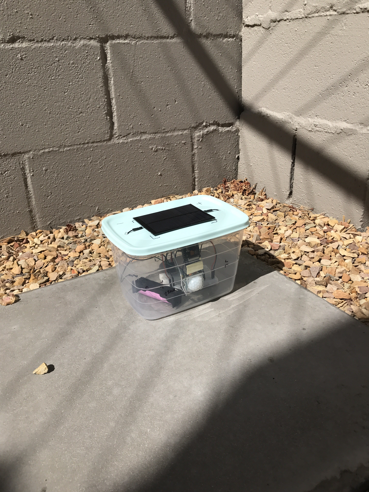
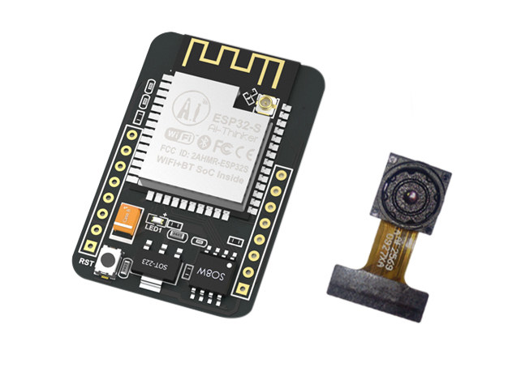
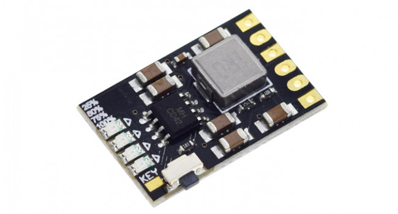
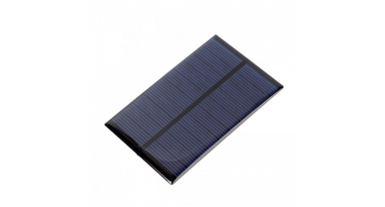
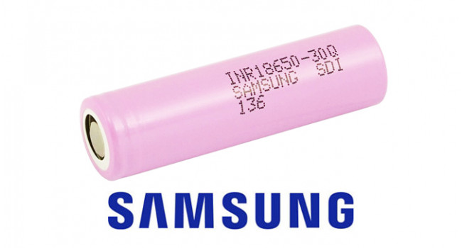
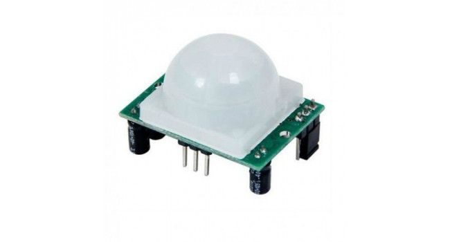

# Box

Simple, power efficient software for my infrared motion detection project.

## Hardware

- ESP32-CAM (5V)

- LiPo Charger (5V out, 3.7V battery in)

- Solar Panel (5V, 170mA)

- 18650 Battery (3.7V, 3000mAh)

- PIR Sensor

- Tupperware Box

## Todo

- Design a 3D printed housing.
- Upgrade the solar panel to 500mA.
- Fix glare in the camera from the sun.
